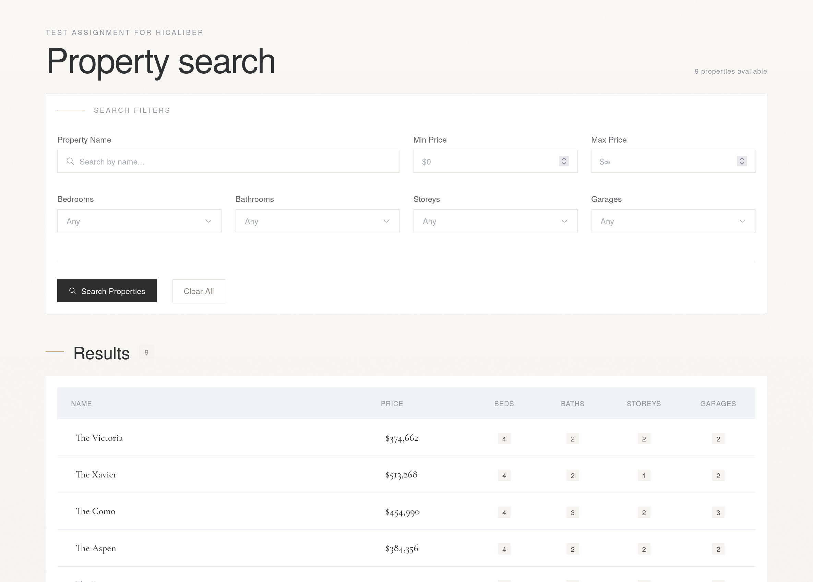

# Property Search Application

**Test Assignment for Hicaliber**

Laravel 12 API + Vue.js application for searching properties.



---

## Test Assignment

### Background

Demonstrate your skills using a varied range of technologies our company commonly uses.
We'll be assessing task completeness as well as code quality.
Publish it to GitHub when finished. Include any instructions, notes, or parts you wish to highlight. Feel free to demonstrate any additional knowledge or skills you have, where applicable to the task.

### Estimated Time

3 hours

### Skills Tested

**Primary:**
- PHP 8.4 (Laravel v12)
- Vue.js
- HTML
- GIT: Commit your work to a local Git repository within your working folder as you finish the logical parts of the task. Include the .git folder. Our company follows a commit early/commit often mantra.

**Bonus (optional):**
- Use Element UI to style the frontend section.

### Tasks

#### API

Using the provided CSV data, create an API route using Laravel that allows the data to be searched.

The data should be converted to a database table. Provide Laravel migrations and seeders within the project.

The API should search on:
- **Name:** Should also match partial names
- **Bedrooms:** Exact match
- **Bathrooms:** Exact match
- **Storeys:** Exact match
- **Garages:** Exact match
- **Price:** Range (between $X and $Y)

All search parameters should be optional. We should be able to search for 2-bedroom houses, 4-bedroom and 2-bathroom houses, etc.

The API should return JSON with pure numeric data (not HTML content).

#### Frontend (Search Form)

Create a basic search form that will query the API using AJAX and display the results it receives from the backend. The search result should be rendered to an HTML table dynamically on the frontend, using reactive Vue.js.

There should be some sort of search indicator, a spinning icon or something similar.

A message should be displayed if no results are found.

---

## Requirements

- PHP 8.4+
- Composer
- Node.js 18+
- npm

## Installation

```bash
# Install PHP dependencies
composer install

# Install Node.js dependencies
npm install

# Copy environment file
cp .env.example .env

# Generate application key
php artisan key:generate

# Create SQLite database
touch database/database.sqlite

# Run migrations and seed
php artisan migrate --seed

# Build frontend assets
npm run build
```

## Running the Application

```bash
php artisan serve
```

Visit http://localhost:8000 in your browser.

## Tech Stack

- **Backend:** Laravel 12, SQLite
- **Frontend:** Vue.js 3, Element Plus, Axios
- **Build Tool:** Vite
